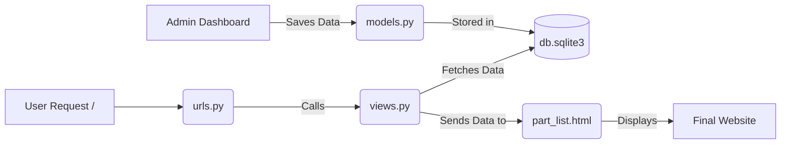

# Factory Inventory Tracker

A simple and elegant Django-based website to manage factory parts inventory. This application allows you to add, track, and view parts like capacitors and resistors with their current stock status.

## 🚀 How to Run the Project

1. **Start the Development Server**:
   ```bash
   python manage.py runserver
   ```
2. **View the Inventory**:
   Open your browser and go to [http://127.0.0.1:8000/](http://127.0.0.1:8000/)
3. **Add New Parts**:
   Go to the Admin Dashboard at [http://127.0.0.1:8000/admin/](http://127.0.0.1:8000/admin/) and log in with your superuser credentials.

---

## 🏗️ How it Works (Django MTV Architecture)

This project follows the **Model-Template-View (MTV)** pattern. Here is how the different files interact:

### 1. The Admin Flow (Adding Data)
When you add a part via the `/admin` dashboard:
- **`inventory/models.py`**: Defines the data structure (Name, Quantity, Status).
- **`inventory/admin.py`**: Registers the model so it appears in the admin dashboard.
- **`db.sqlite3`**: The database where the new part is securely saved.

### 2. The Website Flow (Viewing Data)
When a user visits the homepage:
1.  **`system/urls.py`**: Acts as the receptionist, routing the request to the correct view.
2.  **`inventory/views.py`**: Acts as the waiter, fetching all parts from the database and sending them to the template.
3.  **`inventory/templates/inventory/part_list.html`**: Acts as the chef, formatting the data into a clean HTML table for the user.

### 📊 Application Logic Flow



---

## 📂 Key Files
- `inventory/models.py`: Database table definitions.
- `inventory/views.py`: Logic for fetching and displaying parts.
- `inventory/templates/inventory/part_list.html`: The HTML layout for the inventory table.
- `inventory/admin.py`: Configuration for the admin dashboard.
- `system/urls.py`: URL routing configuration.
